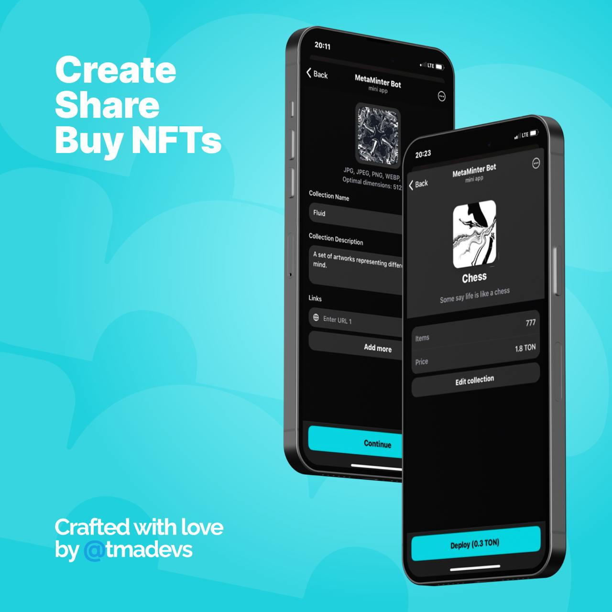

# MetaMinter

Turn-key toolkit to create, manage and share NFT collections on TON.



## What is this?
MetaMinter is a production-ready Telegram Mini App + backend that lets creators launch NFT collections on TON in minutes — without hand-rolling smart contracts, hosting, or ton-connect wiring.

- Intuitive UI to configure price, supply, and sale start
- Seamless sharing of collection pages
- Low and transparent fees compared to heavy marketplaces

Smart contracts live in a separate repo: [MetaMinterContracts](https://github.com/vityooook/MetaMinterContracts).

## Repository structure
This is a monorepo with two apps and shared translations.

- `backend/` — NestJS API, Mongo, auth, file upload, NFT orchestration
- `frontend/` — React + Vite Telegram Mini App UI
- `shared/locales/` — i18n resources (EN/RU)
- `docker-compose.yml` — local stack (backend + frontend + nginx)

## Tech stack
- Frontend: React, TypeScript, Vite, Tailwind, shadcn/ui
- Backend: NestJS, TypeScript, MongoDB
- TON: ton, ton-core, ton-connect in the frontend; on-chain logic in [MetaMinterContracts](https://github.com/vityooook/MetaMinterContracts)

## Quick start
### Prerequisites
- Node.js LTS (>= 18)
- Yarn or npm
- Docker (optional, for one-command stack)

### 1) Run with Docker (recommended for a quick look)
```bash
# from repo root
docker compose up --build
```
- Frontend: http://localhost:5173
- Backend: http://localhost:3000

### 2) Run locally (without Docker)
Open two terminals in repo root.

Backend:
```bash
cd backend
npm install
# dev
yarn start:dev
# or
npm run start:dev
```

Frontend:
```bash
cd frontend
npm install
npm run dev
```

## Configuration
- Frontend app-level settings live in `frontend/src/config.ts` and environment variables (Vite `import.meta.env`).
- Backend uses NestJS configuration modules and Mongo connection (see `backend/src/mongo.module.ts` and `backend/src/config.module.ts`).

Common variables you might set for local runs:
- `MONGODB_URI` — Mongo connection string
- `PORT` — API port (default 3000)
- `VITE_API_URL` — frontend -> backend base URL
- `TONCONNECT_MANIFEST` — path/URL to ton-connect manifest (see `frontend/public/tonconnect-manifest.json`)

## Project layout highlights
- `frontend/src/pages/*` — main flows: create, edit, mint, view
- `frontend/src/hooks/*` — auth, TON client, wallet auth, mutations
- `backend/src/nfts/*` — DTOs, entities, service, controller for NFT/collection flows
- `backend/src/auth/*` — auth modules, guards, strategies (JWT)

## Smart contracts
On-chain contracts, deployment scripts and wrappers are maintained separately:
- Repo: [MetaMinterContracts](https://github.com/vityooook/MetaMinterContracts)
- Build/Test/Deploy with blueprint (`yarn blueprint build/test/run`)

## Scripts
- Frontend: `npm run dev`, `npm run build`, `npm run preview`
- Backend: `yarn start:dev`, `yarn start:prod`, `yarn test`

## License
MIT.
